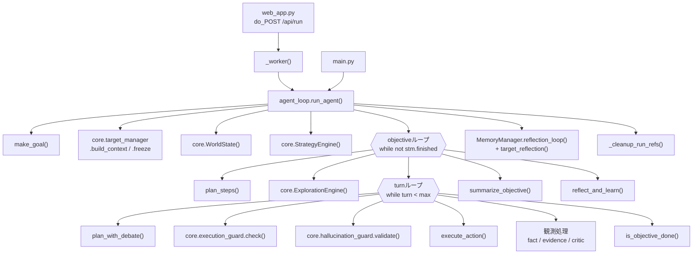
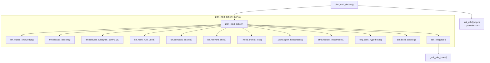
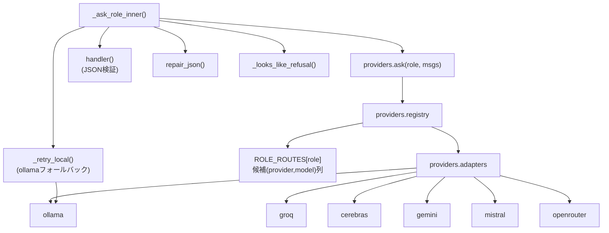
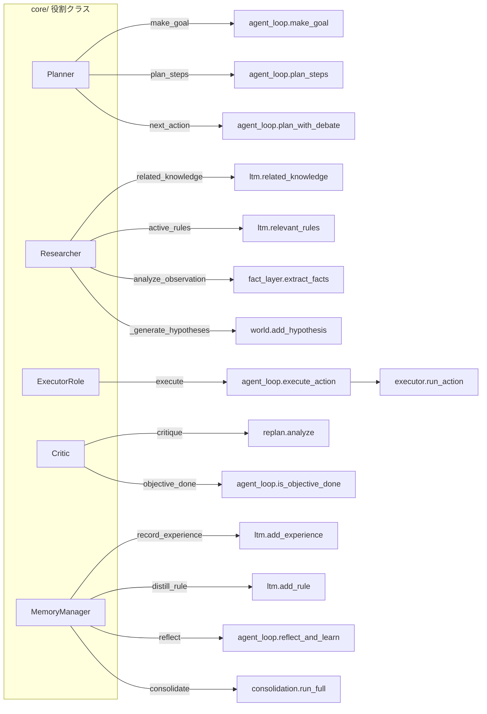
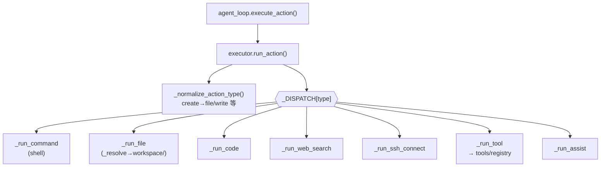
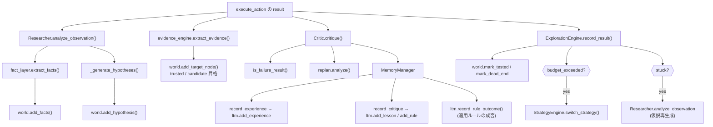
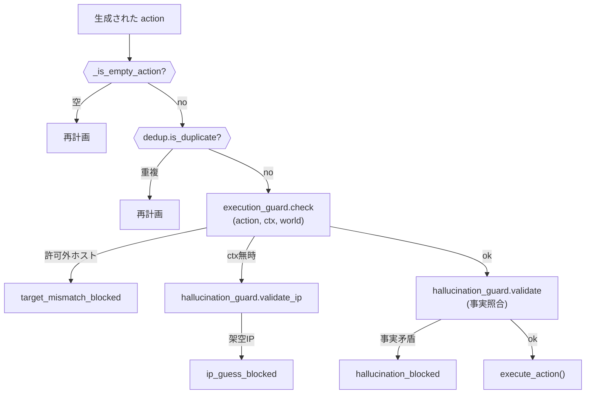
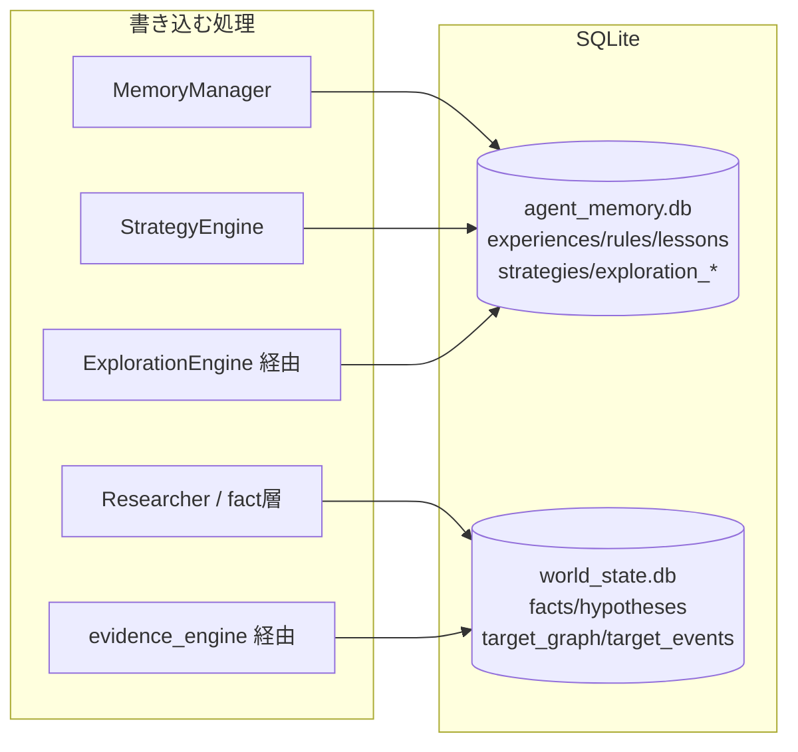

# LocalAgent — クラス・関数の呼び出し関係図

実コードから抽出した呼び出し関係。`agent_loop.run_agent()` を起点に、
役割クラス→委譲先、各ガード、LLM呼び出し、永続化までを追える。

---

## 1. 全体の呼び出しフロー（エントリー → run_agent → 各層）

---

## 2. 計画フェーズ: plan_with_debate / plan_next_action の呼び出し

---

## 3. LLM呼び出しの中核: ask_role → providers

---

## 4. 役割クラス（core/）→ 委譲先（ファサード構造）

役割クラスはロジックを再実装せず、agent_loop / memory / executor へ委譲する。

---

## 5. 実行フェーズ: execute_action → executor ディスパッチ

---

## 6. 観測後の処理: 事実抽出 → 証拠拡張 → 批評 → 学習

実行結果(result)を受けて、5つの処理が順に走る。

---

## 7. ガードの呼び出し順（実行直前の防御）

---

## 8. 永続化の呼び出し先（どの処理がどのDBに書くか）

---

## 凡例・補足

- `ask_role('plan' / 'judge' / ...)` は `providers.ask(role, msgs)` を介して
  `ROLE_ROUTES` の候補(provider,model)列を順に試す（レート制限時は次候補へ）。
- 役割クラス（Planner等）は薄いファサード。実ロジックは委譲先（agent_loop の関数群、
  memory、executor）にあり、これにより既存挙動を壊さず構造を分離している。
- ガードはすべて **execute_action の直前** に集約（図7）。LLMがプロンプトを無視しても、
  許可外ホスト・架空IP・事実矛盾の行動は実行に到達しない。
- 図はレビュー用に層ごとに分割。詳細な責務は `CODE_REVIEW.md`、
  各Phase設計は `ARCHITECTURE*.md` を参照。
