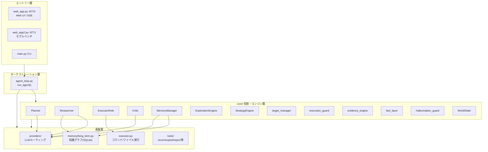
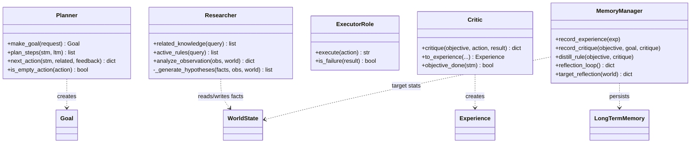
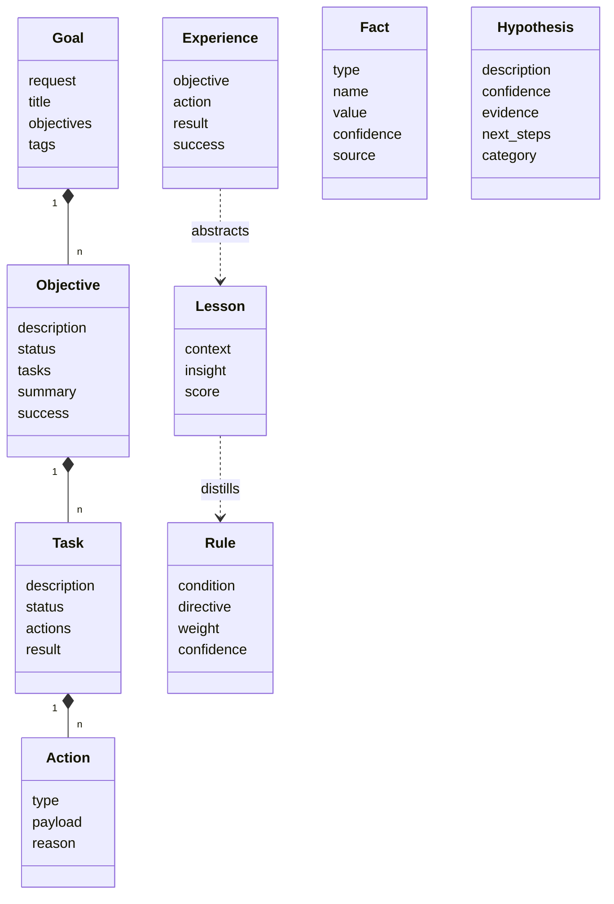
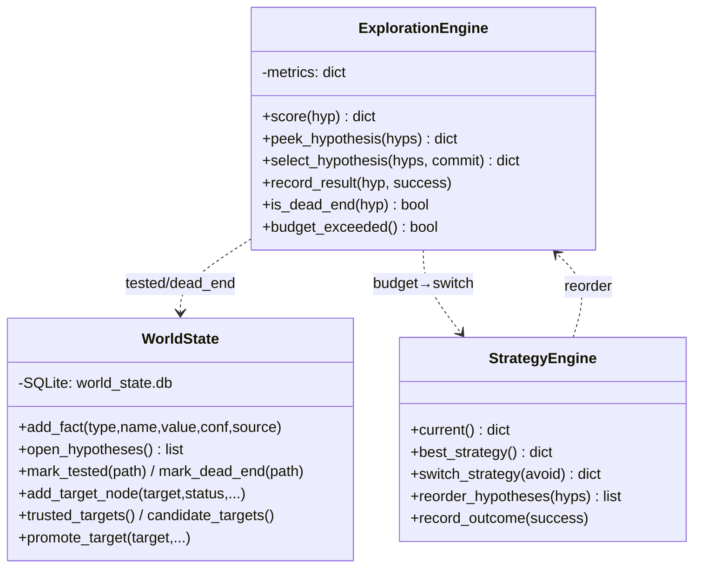
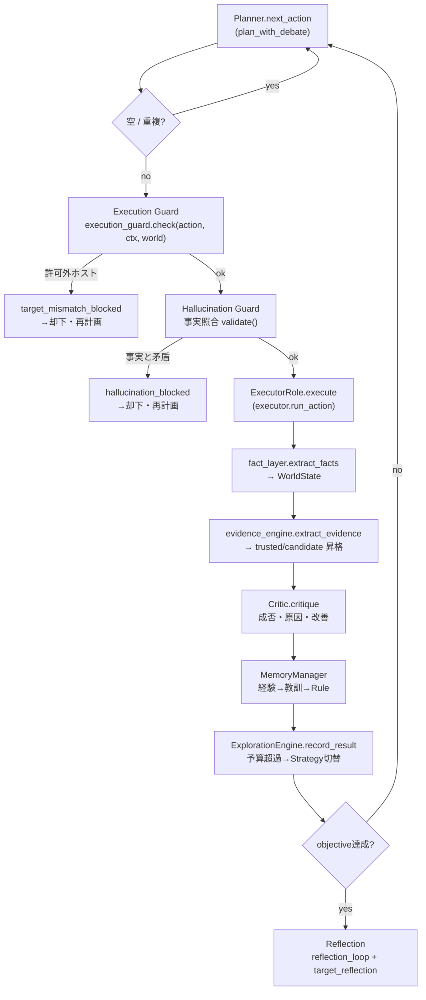
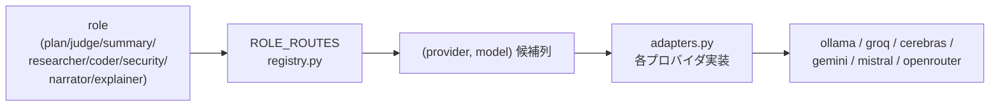

# LocalAgent — コードレビュー資料

自己ホスト型・自律ペネトレーションテストAIエージェント。
Phase 1〜4.1 のリファクタリングを経た現在の構造をまとめる。

- エントリーポイント: `web_app.py`（Web UI, :8770）/ `web_app2.py`（モデルテスト, :8771）/ `main.py`（CLI）
- オーケストレーター: `agent_loop.py`（`run_agent()`）
- 中核ロジック: `core/` パッケージ（役割クラス＋各エンジン）
- Python 3.10+ / 標準ライブラリ中心、外部依存はすべて遅延import＋フォールバック付き

---

## 1. レイヤー構成（全体像）

---

## 2. core/ クラス図（役割クラスと委譲関係）

役割クラスは既存ロジック（agent_loop/memory/executor）への**ファサード**。
ロジックを再実装せず委譲するため、既存挙動を壊さない設計。

### データモデル（core/models.py — dataclass）

### エンジン群（Phase 3〜4.1）

---

## 3. 1ターンの制御フロー（ガードの位置）

ガードは**実行直前**に2段（Execution Guard → Hallucination Guard）。
LLMがプロンプトを無視しても、許可外ホスト・架空IP・事実矛盾の行動は実行されない。

---

## 4. 使用ライブラリ（すべて遅延import＋フォールバック）

| ライブラリ | 用途 | 使用ファイル | 無い場合 |
|---|---|---|---|
| `ollama` | ローカルLLM・埋め込み（中核） | `ollamas/`, `providers/adapters.py`, `memory/embed.py` | クラウドLLMへ。埋め込みは簡易ベクトルへ |
| `python-dotenv` | .envからAPIキー読込 | `get_env/env_controler.py` | 環境変数直読み |
| `groq` | Groq LLM | `groq_llm/`, `providers/adapters.py` | そのプロバイダのみ無効 |
| `cerebras-cloud-sdk` | Cerebras LLM | `cerebras_llm/`, `providers/adapters.py` | 同上 |
| `openai` | OpenRouter（互換クライアント） | `open_router/` | 同上 |
| `google-genai` | Gemini | `google_studio/` | 同上 |
| `mistralai` | Mistral | `mistral_llm/` | 同上 |
| `paramiko` | SSH永続セッション | `ssh_session.py` | subprocessのsshへ |
| `playwright` | ブラウザ操作・動的Web診断 | `tools/browser.py` | 当該ツールのみ無効 |
| `reportlab` | PDF診断レポート | `tools/report_tool.py` | 当該ツールのみ無効 |
| `search-engines-scraper` | Bing等スクレイプ検索 | `engine/bing.py` 等 | DuckDuckGoエンジンへ |

標準ライブラリのみで動く部分: 記憶DB(SQLite)/統計/Web UI(http.server)/承認/モード/
各種ガード/Fact Layer/Exploration/Strategy/Target管理 — **追加インストール不要**。

外部依存ゼロのもの: Tavily検索（urllibで直接API）。

---

## 5. 永続化（保存先）

### SQLite データベース

| ファイル | モジュール | 内容 |
|---|---|---|
| `memory/agent_memory.db` | `memory/long_term.py` | 知識グラフ: memories/entities/relations/lessons/skills/experiences/rules/plans/strategies/exploration_history/exploration_metrics |
| `world_state.db` | `core/world_state.py` | 世界状態: facts/assumptions/hypotheses/tested_paths/dead_ends/confirmed_findings/executed_targets/rejected_targets/**target_graph**/**target_events** |
| `engagement.db` | `engagement.py` | 攻撃グラフ（サービス/脆弱性） |
| `stats.db` | `stats.py` | 実行統計・トークン消費 |

`world_state.db` は run 単位で生成・クローズ（`_cleanup_run_refs()`）。WALモード。

### JSON 設定・状態ファイル（すべて .gitignore 済み）

| ファイル | 内容 |
|---|---|
| `api_keys.json` | APIキー（機密。git除外） |
| `routes.json` | ROLE_ROUTES（役割→モデル割当） |
| `experts.json` / `capabilities.json` | 専門家設定・能力ベクトル |
| `session.json` | 中断再開用の進捗 |
| `kali_tools.json` / `installed.json` | ツール状態 |
| `bench_questions.json` / `bench_results.json` / `ctf_challenges.json` | ベンチ・CTF |

### 作業ディレクトリ
- `workspace/` — エージェントのファイル生成先（executor が必ずここへ解決。脱出不可）

機密（`.env`, `*api_key*`, `*.key`, `*.pem`, `secrets.json`）と全DB・状態JSONは
`.gitignore` で除外済み。公開リポジトリにはコードとプロンプトのみ含まれる。

---

## 6. LLMルーティング（providers/）

- `ask(role, msgs)` が role の候補列を順に試行（レート制限時は次候補へ）。
- `ask_direct(provider, model, msgs)` は ROLE_ROUTES を汚さず並列安全。
- 役割ごとに別モデルを割当可能（例: Planner→Gemini / Coder→Qwen / Critic→GPT-OSS）。
  Web UI の役割マップ（/map）から変更でき、`routes.json` に保存。

---

## 7. レビュー時の着目ポイント

1. **ガードの実行順と網羅性** — `agent_loop.py` の実行直前ブロック（Execution Guard →
   Hallucination Guard）。許可外ホスト・架空IPが実行に到達しないことを確認。
2. **Target の唯一信頼源性** — `core/target_manager.py`（不変Context）＋
   `core/world_state.py` の target_graph（証拠で昇格）。LLM推測は candidate 止まり。
3. **証拠抽出の正確さ** — `core/evidence_engine.py` の正規表現と信頼度割当。
4. **経験学習の配線** — Critic→MemoryManager→Rule→Researcher の循環。
   信頼度ゲート（`relevant_rules(min_confidence=0.35)`）。
5. **状態の後始末** — `_cleanup_run_refs()` と run単位リソース解放（接続リーク防止）。
6. **同時実行制御** — `web_app.py` の `_RUN_ACTIVE`（メインrunは1本に制限）。
7. **フォールバック設計** — 全 core 参照が try/except 内。エンジン不在時は従来動作へ。

各 Phase の詳細設計は `ARCHITECTURE.md`〜`ARCHITECTURE_PHASE4.md` を参照。
